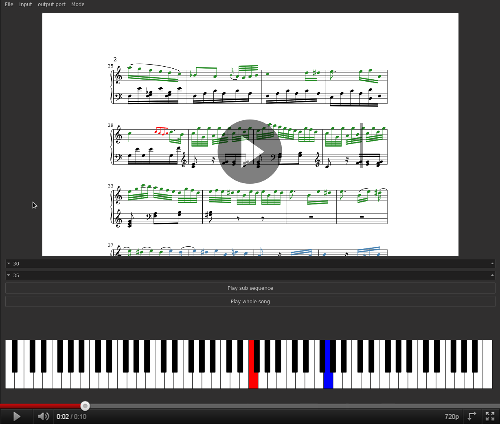

Lilyplayer
========

Lilyplayer plays piano music sheets, as can be seen below

Build dependencies
----------------

`Lilyplayer` requires a C++14 compiler to build. (g++ 5.3 and clang++ 3.6.2 work both fine).
It also depends on the following libraries:

- [`libRtMidi`][rtmidi]
- [`Qt`][qt5]

[rtmidi]: http://www.music.mcgill.ca/~gary/rtmidi/
[qt5]: http://www.qt.io/

Also note that `lilyplayer` does not play music itself. Instead it
relies on a system-wide midi sequencer.  On `GNU/Linux` you might
consider installing `timidity`

On `debian`, one can install them the following way:

	sudo apt-get install timidity libqt5widgets5 libqt5gui5 libqt5core5a qt5-default qt5-qmake g++-5 libqt5svg5 libqt5svg5-dev \
	  gawk sed autoconf libtool libasound2-dev

There is no need to install librtmidi packages as it is already included in this repository as a submode. Cloning this repository
requires therefore to also initialise its submodule.

Compiling instructions
-------------------

Once all the dependencies have been installed, you can simply compile `lilyplayer` by entering:

	git clone --recursive 'https://github.com/s-d-m/lilyplayer'
	cd lilyplayer
	make

This will generate the `lilyplayer` binary in `./bin`

If you want to generate an appimage, you will also need the `wget` and  `realpath` binary. On debian it is provided as part of the
`coreutils` package. On Ubuntu it is on its own package. Therefore, use

	sudo apt-get install coreutils wget

on debian. And on ubuntu, type

	sudo apt-get install realpath wget

Then you can generate the appimage using:

	make appimage

A file lilyplayer-x86_64.AppImage should be generated in the bin folder

How to use
----------

Pianoterm needs a midi sequencer. If you decided to use timidity, you will need to run it first using:

	timity -iA &

Then you can run the application by typing

	./bin/lilyplayer

This will open an a window showing a piano keyboard.
On the "output port" menu, you can select the midi sequencer like `TiMidity xxx:0`.
On the "input" menu, you can either select an input keyboard (e.g. a [virtual midi keyboard player][vmpk])

[vmpk]: http://sourceforge.net/projects/vmpk/

or you can play a midi file by choosing `select file` in the input menu, or using the `Ctrl + O` shortcut.

When playing a midi file, one can play/pause it using the `space` key, or the `Ctrl + P` shortcut.

Misc
-----

To generate your own music sheets, see [lilydumper](https://github.com/s-d-m/lilydumper) or simply grab
pre-made one [here](https://github.com/s-d-m/precompiled_music_sheets_for_lilyplayer)

Other files you may want to read
--------------------------------

todo.txt contains a list of things that I still need to do.

Bugs & questions
--------------

Report bugs and questions to da.mota.sam@gmail.com (I trust the anti spam filter)
